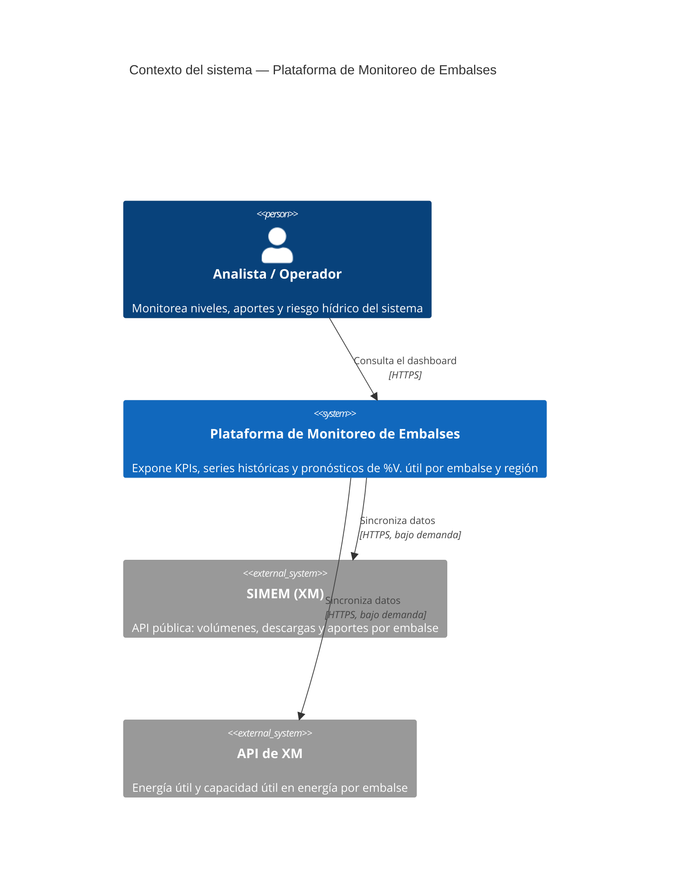
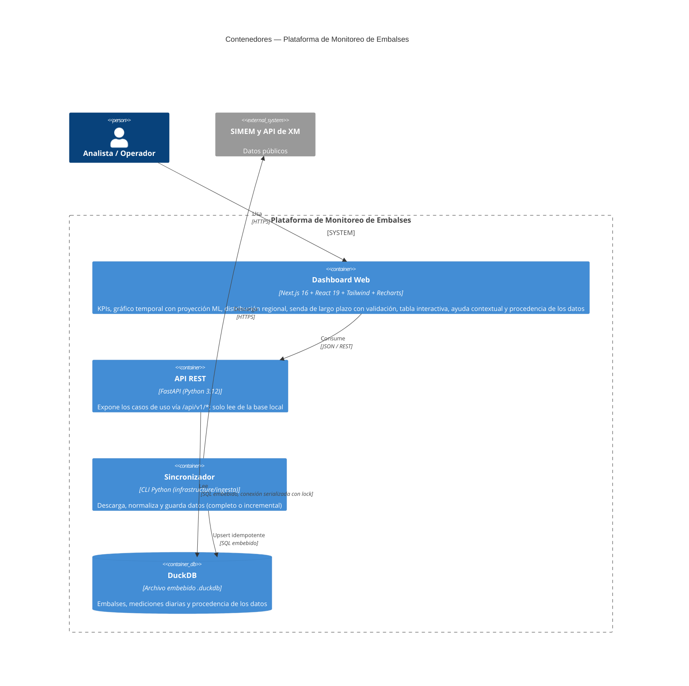
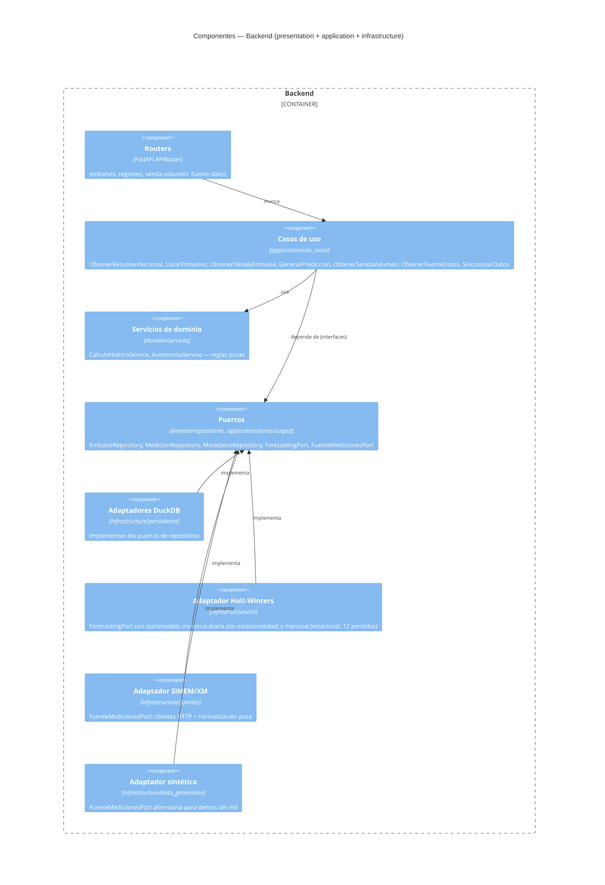

# Plataforma de Monitoreo y Predicción de Embalses

[](https://github.com/alerogoz85/plataforma-embalses/actions/workflows/ci.yml)

Plataforma de monitoreo hidrológico con **datos reales y públicos de XM/SIMEM**
(Colombia): volumen y energía útiles, aportes, descargas, pronóstico diario de
%V. útil a 30/60/90 días y una senda mensual de largo plazo (6/12/18 meses) con
validación walk-forward. Backend con arquitectura hexagonal y dashboard Next.js
con ayuda contextual (ⓘ) en cada encabezado técnico.

> **Los datos son reales**, descargados de SIMEM y de la API de XM con un
> comando de sincronización, y se guardan en una base DuckDB local (la API no
> llama a servicios externos en cada consulta). El pie del dashboard muestra
> la procedencia y la fecha de corte. Los **pronósticos**, en cambio, son
> modelos estadísticos propios sobre esa historia — no son proyecciones
> oficiales (ver [Alcance y límites](#alcance-y-límites)). Existe una fuente
> sintética opcional para demostraciones sin red; si se usa, el dashboard lo
> declara ("Datos no reales").

## Índice

- [Arquitectura](#arquitectura)
- [Diagramas C4](#diagramas-c4)
- [Datos y fuentes](#datos-y-fuentes)
- [Modelo de cálculo hídrico](#modelo-de-cálculo-hídrico)
- [Alcance y límites](#alcance-y-límites)
- [Estructura del repositorio](#estructura-del-repositorio)
- [Cómo ejecutar el proyecto](#cómo-ejecutar-el-proyecto)
- [Despliegue en Vercel](#despliegue-en-vercel)
- [Referencia de la API](#referencia-de-la-api)
- [Pruebas](#pruebas)
- [Decisiones de diseño](#decisiones-de-diseño)

## Arquitectura

El backend sigue **Arquitectura Hexagonal (Puertos y Adaptadores)** con cuatro
capas estrictamente desacopladas:

| Capa | Responsabilidad | Depende de |
|---|---|---|
| `domain/` | Entidades, value objects y servicios de cálculo hídrico puros. Sin dependencias externas. | Nada |
| `application/` | Casos de uso, DTOs (Pydantic) y puertos (interfaces) de entrada/salida. | `domain/` |
| `infrastructure/` | Adaptadores concretos: DuckDB, fuentes de datos (SIMEM/XM, sintética), pronóstico Holt-Winters. | `domain/`, `application/` |
| `presentation/` | API REST (FastAPI): routers, DTOs de transporte, manejo de errores. | `application/` |

La regla de dependencia siempre apunta hacia adentro: `domain` no importa
nada de `application` ni `infrastructure`; `application` sólo conoce
interfaces (`domain.repositories.*`, `application.ports.output.*`), nunca
implementaciones concretas. El *composition root* —el único lugar donde se
conectan interfaces con implementaciones— es
[`presentation/api/dependencies.py`](backend/presentation/api/dependencies.py)
para la API y [`infrastructure/ingesta/sincronizar.py`](backend/infrastructure/ingesta/sincronizar.py)
para la sincronización.

Esto permitió conectar datos reales sin tocar los casos de uso de consulta: la
fuente es un puerto (`FuenteMedicionesPort`) con dos adaptadores intercambiables
(SIMEM/XM y sintética), y sustituir DuckDB por PostgreSQL o Holt-Winters por
Prophet/XGBoost solo requiere implementar `EmbalseRepository`/`MedicionRepository`
o `ForecastingPort`.

## Diagramas C4

### Nivel 1 — Contexto



### Nivel 2 — Contenedores



### Nivel 3 — Componentes del backend



## Datos y fuentes

| Fuente | Dataset / métrica | Qué aporta |
|---|---|---|
| SIMEM | `138ED1` | Capacidad útil y volumen útil diario por embalse (m³), región hidrológica |
| SIMEM | `1445AC` | Descargas por embalse (turbinada, no turbinada, vertimiento; m³/día) |
| SIMEM | `02B289` | Aportes por serie hidrológica de río (m³/s) y su media histórica |
| XM | `VoluUtilDiarEner` | Energía útil almacenada por embalse (kWh → GWh) |
| XM | `CapaUtilDiarEner` | Capacidad útil en energía por embalse (kWh → GWh); es el peso de agregación |

- **Embalses:** los 23 embalses individuales que publica XM más el **agregado
  Bogotá** (XM lo publica como una sola entidad y entra al total nacional; su
  código cambió de `AGREGADO_BOGOTA` a `AGREGADO` en enero de 2025 y aquí se
  unifica). El agregado nacional oficial `AGREGADO_SIN` no es un embalse: se usa
  solo como referencia de validación.
- **Aportes:** SIMEM publica aportes por serie de río, no por embalse. El
  mapeo río → embalse
  ([`SERIE_A_EMBALSE`](backend/infrastructure/fuentes/simem_xm_fuente.py))
  viene del proyecto de modelado previo (`1. Modelo niveles de embalses`),
  con los códigos vigentes y los que XM renombró. Varias series de un mismo
  embalse se suman. **Muna y el agregado Bogotá no tienen serie de aportes.**
- **Lo que no se publica no se inventa:** no hay cota, potencia instalada,
  evaporación ni generación por embalse en estas fuentes, así que la plataforma
  ya no las muestra. Cuando un dato falta un día (o para un embalse), queda
  `None` y la interfaz muestra "—", nunca un cero.
- **Validado contra XM:** el %V. útil nacional calculado aquí coincide
  exactamente con el agregado oficial en las últimas fechas (p. ej. 78.12,
  77.86 y 77.52 en 2026-09-20/21/22). Sobre 1.118 días comparables el error
  absoluto medio es 0.04 p.p. (8 días superan 0.3 p.p., por vacíos de la
  fuente).

## Modelo de cálculo hídrico

Implementado como funciones puras en
[`domain/services/calculo_hidrico_service.py`](backend/domain/services/calculo_hidrico_service.py)
y
[`domain/services/autonomia_service.py`](backend/domain/services/autonomia_service.py):

- **% Volumen útil** = `volumen útil del día / capacidad útil del día × 100`,
  con la capacidad que XM publica *ese día*, porque XM la revisa con el tiempo.
  No se acota en 100%: XM publica valores mayores cuando un embalse supera su
  capacidad nominal (p. ej. Playas).
- **Clasificación de riesgo**: Óptimo 30–95%, Alerta 15–30%, Crítico <15%,
  Reboce ≥95% ([`Porcentaje.nivel_riesgo`](backend/domain/value_objects/porcentaje.py)).
- **Agregación nacional/regional**: promedio del %V. útil ponderado por la
  **capacidad útil en energía (GWh)** de cada embalse ese día, la convención de
  la métrica oficial de XM «% Volumen Útil Diario (GWh)». Se usa en los KPIs,
  la distribución regional y la serie "Total nacional" de la senda. Si XM no
  publica la capacidad de un embalse un día, el *peso* usa la última capacidad
  publicada más cercana (cambia muy poco) y la energía almacenada queda `None`;
  con esto el error medio frente a XM bajó de 0.50 a 0.04 p.p.
- **Aportes % de la media**: total de aportes ÷ total de la media histórica,
  solo entre los embalses que publican ambos (no un promedio de porcentajes).
- **Capacidad guardada (GWh)**: suma de la energía útil publicada por XM.
- **Días de autonomía**: `volumen útil / (turbinado + vertimientos − aportes)`.
  Es una **estimación aproximada**: no incluye evaporación (no publicada) ni
  entradas distintas al río asociado, por lo que en embalses de una cadena
  (p. ej. Punchiná, que recibe agua turbinada aguas arriba) puede ser
  engañosamente baja. Es `None` si falta algún dato o si los aportes superan las
  salidas.
- **Pronóstico diario (30/60/90 días)**: Holt-Winters con tendencia
  amortiguada (`statsmodels`), sin estacionalidad; intervalo de confianza al
  95% por simulación Monte Carlo (300 trayectorias).
- **Senda mensual**: la serie diaria se agrega a promedios mensuales y se
  proyecta a 6, 12 o 18 meses con Holt-Winters **estacional** (12 periodos, con
  fallback automático a no estacional si hay menos de 24 meses). Se valida con
  un backtest walk-forward de los últimos 6 meses (MAE y R²) contra una línea
  base de persistencia. Semáforo del mínimo proyectado: rojo <55%, ámbar <65%,
  verde ≥65%.

## Alcance y límites

- Los **pronósticos son estadísticos y solo ven la serie histórica**: no
  incorporan clima (El Niño/La Niña), demanda, precios ni operación futura, a
  diferencia de modelos oficiales que usan variables exógenas. Léelos como la
  forma estacional esperada, no como una predicción puntual. La tabla de
  validación muestra cuánto supera el modelo a la persistencia y puede ser
  peor en algunos embalses.
- XM **revisa datos recientes**: cada sincronización incremental vuelve a
  descargar los últimos 7 días para recoger esas correcciones.
- Hay huecos de energía publicada para algunos embalses y periodos (p.
  ej. Miraflores entre abr-2024 y abr-2025); se conservan los volúmenes reales y
  se documenta la imputación del peso (arriba).
- El historial cargado por defecto empieza el 2022-01-01
  (`--desde` lo cambia); los embalses que entraron después (p. ej. Ituango,
  desde dic-2022) tienen menos historia.
- La API solo lee de la base local: para tener datos al día hay que ejecutar la
  sincronización.

## Estructura del repositorio

```
plataforma-embalses/
├── backend/
│   ├── domain/                  # Entidades, value objects, servicios, interfaces de repositorio
│   ├── application/              # DTOs, puertos, casos de uso (incl. SincronizarDatos)
│   ├── infrastructure/
│   │   ├── persistence/          # DuckDB (schema.sql, conexión thread-safe, repositorios)
│   │   ├── fuentes/              # Clientes HTTP (SIMEM, XM) y adaptador SimemXmFuenteMediciones
│   │   ├── data_generation/      # Fuente sintética opcional (catálogo + generador)
│   │   ├── ingesta/              # CLI de sincronización
│   │   └── ml/                   # Adaptador de pronóstico Holt-Winters
│   ├── presentation/api/         # FastAPI: main, dependencies (composition root), routers, arranque_vercel
│   ├── index.py, vercel.json     # Punto de entrada y configuración del despliegue en Vercel
│   ├── tests/                    # Pruebas (pytest)
│   └── requirements*.txt
├── frontend/
│   ├── app/                      # Next.js App Router (layout, page, globals.css con los tokens de la identidad visual)
│   ├── public/marca/             # Logos GOV.CO y Ministerio de Minas y Energía (el favicon del navegador es el del Ministerio: app/favicon.ico)
│   ├── components/
│   │   ├── layout/                # Header (franja GOV.CO + logo), ThemeToggle
│   │   ├── dashboard/              # KpiCard, SistemaRiesgoCard, RiskBadge, FiltersPanel, MainChart, RegionBarChart, SendaVolumenPanel, EmbalsesTable, ayudas.tsx (textos de ayuda)
│   │   └── ui/                     # Card, Skeleton, InfoButton (botón ⓘ)
│   ├── tests/                    # Pruebas (Vitest + Testing Library): utils, api, hooks, components, app, mocks, fixtures
│   └── lib/
│       ├── api/                    # client.ts, types.ts (espejo de los DTOs del backend)
│       ├── hooks/                  # useAsyncResource, useResumenNacional, useEmbalseDetalle, usePrediccion, useSendaVolumen, useFuenteDatos
│       └── utils/                  # formatters.ts, dates.ts
├── scripts/                       # desplegar-vercel.sh (publica la API en Vercel)
├── data/                          # hidrologia.duckdb (generado por la sincronización, no versionado)
└── README.md
```

## Cómo ejecutar el proyecto

### Requisitos

- Python 3.12+
- Node.js 20+
- npm
- Acceso a internet para la sincronización (SIMEM y `servapibi.xm.com.co`)

### 1. Backend

```bash
cd plataforma-embalses/backend
python3.12 -m venv .venv
source .venv/bin/activate
pip install -r requirements-dev.txt   # incluye pytest, httpx y pyflakes; usa requirements.txt para solo ejecutar
```

Carga inicial de datos reales (unos 2 minutos; descarga desde 2022-01-01):

```bash
python -m infrastructure.ingesta.sincronizar --fuente simem --reiniciar
```

Para actualizar después (incremental: desde la última fecha guardada menos 7
días), con la API detenida porque DuckDB admite un solo proceso sobre el archivo:

```bash
python -m infrastructure.ingesta.sincronizar --fuente simem
```

Otras opciones: `--desde YYYY-MM-DD`, `--hasta YYYY-MM-DD`, `--db-path`, y
`--fuente sintetica` para una demostración sin red (datos simulados que el
dashboard marca como no reales).

> Una base creada con la versión anterior (datos sintéticos con cota y
> generación) no es compatible: la API se niega a abrirla y pide ejecutar la
> carga con `--reiniciar`, en lugar de borrarla sin avisar.

Levanta la API:

```bash
uvicorn presentation.api.main:app --reload --port 8000
```

La documentación interactiva queda disponible en `http://localhost:8000/docs`.

### 2. Frontend

```bash
cd plataforma-embalses/frontend
npm install
cp .env.example .env.local   # ajusta NEXT_PUBLIC_API_BASE_URL si es necesario
npm run dev
```

Abre `http://localhost:3000`.

### 3. Pruebas

```bash
# Backend
cd plataforma-embalses/backend && source .venv/bin/activate && python -m pytest -q

# Frontend
cd plataforma-embalses/frontend && npm test          # una corrida; `npm run test:watch` para desarrollo
```

## Despliegue en Vercel

En producción: **https://plataforma-embalses.vercel.app**

Son dos proyectos de Vercel:

| Proyecto | Carpeta | Qué es | Cómo se despliega | URL |
|---|---|---|---|---|
| `plataforma-embalses` | `frontend/` | Sitio Next.js | **Automático por Git** | https://plataforma-embalses.vercel.app |
| `plataforma-embalses-api` | `backend/` | FastAPI como función Python ([`index.py`](backend/index.py), [`vercel.json`](backend/vercel.json)) | Por CLI: `scripts/desplegar-vercel.sh` | https://plataforma-embalses-api.vercel.app |

### Sitio: despliegues automáticos por Git

El proyecto del sitio está conectado a este repositorio (directorio raíz
`frontend/`, rama de producción `main`):

- **Merge a `main`** → despliegue de **producción**.
- **Pull request** → despliegue de **vista previa** con su propia URL (aparece
  como comentario en el PR).
- Las vistas previas usan la misma API de producción (variables de entorno del
  entorno *Preview*), así que muestran datos reales.
- Se compila en cada push aunque solo cambie el backend; es rápido (~40 s) y evita
  depender de una regla de omisión que podría saltarse un cambio real.

El sitio reenvía `/api/v1/*` a la API con un *rewrite*
([`next.config.ts`](frontend/next.config.ts)), así que el navegador solo habla con
el dominio del sitio (sin CORS). Variables (Production y Preview):
`NEXT_PUBLIC_API_BASE_URL=/` y `API_URL=https://plataforma-embalses-api.vercel.app`.

Como el directorio raíz es `frontend/`, el sitio **no** se debe desplegar con
`vercel deploy` desde la CLI: se hace por Git.

### API: despliegue por CLI

La API **no** está conectada a Git: su base de datos no está en el repositorio, así
que un despliegue automático no tendría datos.

```bash
scripts/desplegar-vercel.sh          # copia data/hidrologia.duckdb, empaqueta y publica
```

- **La base viaja con el despliegue.** `data/hidrologia.duckdb` (~7 MB) se copia a
  `backend/data/` (ignorado por git) y se empaqueta. El disco de la función es de
  solo lectura, así que al arrancar se copia a `/tmp`
  ([`arranque_vercel.py`](backend/presentation/api/arranque_vercel.py)).
- **Los datos no se actualizan solos.** La sincronización con XM no corre en
  Vercel. Para actualizar: sincronizar en local y volver a publicar la API.

  ```bash
  cd backend && source .venv/bin/activate
  python -m infrastructure.ingesta.sincronizar --fuente simem    # con la API local detenida
  cd .. && scripts/desplegar-vercel.sh
  ```
- **Arranque en frío.** La primera consulta tras un rato de inactividad tarda unos
  segundos más (importar statsmodels y copiar la base). El paquete pesa ~310 MB
  descomprimidos y cupo en el límite del plan; si crece (dependencias nuevas)
  puede dejar de caber.
- `vercel link` escribe un token temporal en `.env.local`; el script lo retira, y
  `.env*` está ignorado por git.

## Referencia de la API

Prefijo base: `/api/v1`

| Método | Ruta | Descripción |
|---|---|---|
| GET | `/embalses/resumen` | KPIs nacionales agregados + corte por región + listado de embalses. Filtros: `region` (repetible), `embalse` (repetible), `fecha` |
| GET | `/embalses` | Listado de embalses con ficha resumida. Filtros: `region`, `fecha_inicio`, `fecha_fin` (incluye serie histórica si se pasan fechas) |
| GET | `/embalses/{id}` | Último dato + serie histórica de un embalse (id = código XM, p. ej. `GUAVIO`) |
| GET | `/embalses/{id}/prediccion` | Pronóstico de %V. útil. Query: `horizonte` = 30, 60 o 90 |
| GET | `/embalses/{id}/reporte` | Descarga CSV o JSON de la serie histórica. Query: `formato`, `fecha_inicio`, `fecha_fin` |
| GET | `/regiones` | Agregado por región hidrológica |
| GET | `/senda-volumen` | Senda mensual observada + proyectada de %V. útil, con validación walk-forward (MAE/R² del modelo vs. persistencia). Query: `embalse` (id o `TOTAL`), `horizonte_meses` = 6, 12 o 18 |
| GET | `/fuente-datos` | Procedencia de los datos (fuente, si son reales, fecha de corte, última actualización) |
| GET | `/salud` | Health check |

Los campos que la fuente no publica se devuelven como `null`. Errores de
dominio se traducen a HTTP de forma centralizada en
[`presentation/api/error_handlers.py`](backend/presentation/api/error_handlers.py):
`EmbalseNoEncontradoError`/`SinMedicionesError` → 404,
`DatosHistoricosInsuficientesError` → 422, cualquier otro `DomainError` → 400.

## Pruebas

### Integración continua

[`.github/workflows/ci.yml`](.github/workflows/ci.yml) corre en cada push a `main`
y en cada pull request, con dos jobs en paralelo:

- **Backend** (Python 3.12): `pyflakes` sobre el código y las pruebas, y `pytest`.
- **Frontend** (Node 22): `npm ci`, `npm run lint`, `npm test` y `npm run build`
  (el build también verifica los tipos de TypeScript).

No usa secretos ni red hacia SIMEM/XM: las pruebas no llaman a servicios externos.
Una ejecución nueva sobre la misma rama cancela la anterior.

### Flujo de trabajo y protección de `main`

La rama `main` está protegida (incluye a los administradores):

- Los cambios entran **solo por pull request**; no se puede hacer push directo.
- Deben pasar los dos checks de CI —`Backend (pyflakes + pytest)` y
  `Frontend (lint + pruebas + build)`— y la rama debe estar al día con `main`.
- Historial lineal (se fusiona con *squash* o *rebase*), sin push forzado, sin
  borrar la rama y con las conversaciones resueltas.
- No exige aprobaciones de revisión (proyecto de una sola persona); si se suman
  colaboradores conviene subir `required_approving_review_count`.

```bash
git switch -c mi-cambio            # trabajar en una rama
git push -u origin mi-cambio
gh pr create --fill                # abrir el pull request
gh pr merge --squash --delete-branch   # cuando los checks estén en verde
```

### Backend — 175 pruebas (pytest)

175 pruebas con pytest, sin red ni base de datos externa (repositorios,
fuente y pronóstico en memoria —ver [`tests/fakes.py`](backend/tests/fakes.py)—, y
DuckDB sobre archivos temporales). Las pruebas HTTP usan `TestClient` de FastAPI
(requiere `httpx`, incluido en `requirements-dev.txt`):

| Archivo | Pruebas | Qué cubre |
|---|---|---|
| `test_domain_calculos.py` | 28 | %V. útil con la capacidad del día, sin acotar en 100%, umbrales de riesgo, aportes % media, energía y peso, autonomía (incluye turbinada y datos faltantes), value objects |
| `test_agregacion.py` | 15 | Agregación mensual; KPI y regiones ponderados por energía (no volumen); agregados en el total; energía no publicada; aportes como total/total |
| `test_senda_volumen.py` | 20 | Senda por embalse y "Total nacional", horizontes, mínimo proyectado, errores de dominio, MAE/R² con valores calculados a mano, sin fuga de datos futuros |
| `test_holt_winters_estacional.py` | 7 | Ciclo anual, fallback con <24 meses, pasos de fecha, acotamiento 0–100 |
| `test_fuente_simem_xm.py` | 26 | Conversión de unidades (m³→Mm³, m³/día→m³/s, kWh→GWh), mapeo río→embalse, agregado Bogotá y `AGREGADO_SIN`, datos faltantes como `None`, imputación del peso, región desconocida, cliente XM en bloques de 30 días, errores de red |
| `test_api_http.py` | 56 | Contrato HTTP sobre la app real con los casos de uso reales y repositorios en memoria: los 9 endpoints, códigos 404/405/422 y su `detalle`, filtros y validación de parámetros, `null` en datos no publicados, CSV/JSON descargable (celdas vacías, no ceros), la ruta `/resumen` frente a `/{id}`, forma del JSON de la senda, OpenAPI y CORS (origen permitido, otros rechazados, preflight solo GET) |
| `test_arranque_vercel.py` | 4 | Copia de la base empaquetada a `/tmp` (no pisa copias existentes, error claro si falta) |
| `test_sincronizacion_y_persistencia.py` | 19 | Sincronización completa/incremental/idempotente, procedencia, ida y vuelta en DuckDB con nulos, upsert, esquema heredado (rechazo y `--reiniciar`) |

Se comprobó además que las pruebas detectan fallos: al introducir a propósito
regresiones (ponderar por volumen, entrenar con el mes evaluado, quitar la
estacionalidad, usar el último valor en vez del promedio mensual y, en la capa
HTTP, abrir CORS, permitir DELETE, devolver 400 en vez de 404/422, aceptar
horizontes no permitidos, escribir 0 en el CSV o registrar `/{id}` antes de
`/resumen`) cada una hizo fallar al menos una prueba.

El backend no se prueba contra DuckDB con datos reales (los endpoints usan
repositorios en memoria; DuckDB se prueba aparte). La descarga real de SIMEM/XM
se verificó manualmente (carga completa e incremental) y contra el agregado
oficial de XM, pero no en las pruebas automáticas, que no usan red.

### Frontend — 182 pruebas (Vitest + React Testing Library + jsdom)

Cada prueba corre sin red ni backend: `fetch` se simula por ruta
([`tests/mocks/fetch.ts`](frontend/tests/mocks/fetch.ts)) con datos de ejemplo
([`tests/fixtures.ts`](frontend/tests/fixtures.ts)).

| Archivo | Pruebas | Qué cubre |
|---|---|---|
| `utils/formatters.test.ts` | 12 | Formato es-CO, "—" para datos no publicados (y el cero real como cero), deltas con signo, fechas sin corrimiento, etiquetas y paleta de riesgo |
| `utils/dates.test.ts` | 6 | Fechas en calendario **local** (hora de Bogotá): no se adelanta un día de noche |
| `api/client.test.ts` | 19 | Construcción de URLs y query strings (parámetros repetibles, vacíos omitidos), `urlReporte`, cancelación, errores (`detalle` de dominio y `detail` de FastAPI, fallos de red) y URL base según el entorno (local vs. `/` en producción) |
| `hooks/useAsyncResource.test.tsx` | 10 | Estados cargando/datos/error, cancelación al desmontar y al cambiar dependencias, gana la última respuesta, sin peticiones repetidas |
| `components/InfoButton.test.tsx` | 13 | Botón ⓘ: aria, mostrar al pasar el cursor/enfocar y ocultar al salir, clic táctil, Escape, fuera, scroll, resize, no propaga el clic, un solo panel, posición dentro de la pantalla |
| `components/tarjetas.test.tsx` | 15 | KpiCard, RiskBadge y SistemaRiesgoCard (color del delta, niveles de riesgo, ayuda) |
| `components/FiltersPanel.test.tsx` | 11 | Seis regiones (incl. Caldas), embalses según región, callbacks (`null`, no cadena vacía), botón «Restablecer filtros», límites de fechas, ayudas |
| `components/EmbalsesTable.test.tsx` | 22 | Orden (asc/desc, texto, nulos), búsqueda, "—" por dato no publicado, cero real, insignia "Agregado", selección de fila, enlaces de reporte, esqueletos |
| `components/graficos.test.tsx` | 19 | Regiones (orden, color por riesgo, eje sobre 100%) y gráfico principal (punto puente histórico→proyección, huecos `null`, series, horizonte, errores parciales) |
| `components/SendaVolumenPanel.test.tsx` | 23 | Semáforo del mínimo proyectado en los umbrales exactos, datos del gráfico, tabla de validación, selectores, estados de carga y error |
| `components/ThemeToggle.test.tsx` | 6 | Preferencia guardada vs. del sistema, clase `dark`, sincronía entre botones |
| `app/page.test.tsx` | 20 | Página completa con la API simulada: KPIs, procedencia real/no real, selección automática, rango de 180 días, **cambio de región sin dejar un embalse de otra región seleccionado**, «Todos los embalses» que se mantiene, restablecer filtros (región, embalse y fechas), error de API |
| `app/ayudas.test.tsx` | 6 | Catálogo de ayudas (títulos únicos, sin textos obsoletos) y auditoría: todo encabezado, columna, filtro y tarjeta tiene su ⓘ y todos abren y cierran |

Recharts se sustituye por un doble
([`tests/mocks/recharts.tsx`](frontend/tests/mocks/recharts.tsx)) porque jsdom no
calcula tamaños y no dibuja SVG: las pruebas verifican **los datos y la
configuración que el código entrega a los gráficos** (puntos, series, ejes,
colores), no el dibujo. No hay pruebas de extremo a extremo con un navegador ni
regresión visual.

Además de que pasen, se comprobó que detectan fallos: se introdujeron 16
regresiones a propósito (orden invertido, `null` mostrado como 0, clic en enlace
que selecciona la fila, no corregir el embalse al cambiar de región, pie que
siempre dice "reales", gráfico sin punto puente, umbral ámbar `<=`, eje Y fijo en
100, ⓘ sin `stopPropagation` o sin Escape, fechas en UTC, parámetro mal nombrado
en el cliente, delta sin `+`, filtro que no limpia el embalse, regiones en orden
inverso, hook que no cancela). Una no se detectó al inicio (`null` como 0 en la
columna Turbinado); se añadió la prueba faltante y ahora se detecta.

Las pruebas encontraron **tres defectos reales**, ya corregidos:
1. `hoyISO()`/`fechaHaceDias()` usaban UTC: a partir de las 7 p. m. en Colombia
   el rango por defecto terminaba "mañana".
2. El cliente ignoraba el campo `detail` de los errores de validación de FastAPI
   y mostraba solo "Error".
3. La ayuda de "Reporte" aún decía que el CSV traía "cota y generación", que ya
   no existen.

## Decisiones de diseño

- **Identidad visual del sector**: la paleta y las tipografías siguen las de
  minenergia.gov.co (sistema GOV.CO): azul `#3366CC`/`#004884`, amarillo
  institucional `#EDB600`, verde `#068460`, Nunito Sans (texto) y Montserrat
  (títulos). Todo vive en tokens CSS de `frontend/app/globals.css`. El color de
  marca (`--color-marca`, azul) está separado del semáforo de estado
  (`--color-optimo/alerta/critico/reboce`) para que "verde" siempre signifique
  "óptimo". El encabezado lleva la franja GOV.CO y el logo del
  Ministerio (descargados de minenergia.gov.co a `frontend/public/marca/`); el
  pie repite el logo y declara la procedencia de los datos. Los logos son
  propiedad del Ministerio y se usan solo con su autorización.
- **Datos reales detrás de un puerto**: `FuenteMedicionesPort` aísla el origen
  de los datos; la descarga vive en un adaptador y la interpretación
  (`ensamblar`, `indexar_*`) son funciones puras probadas sin red. La API no
  consulta servicios externos: lee de DuckDB, así responde rápido y no depende
  de la disponibilidad de XM.
- **El modelo se ajustó a lo que XM publica**: la capacidad útil y el volumen
  muerto **cambian en el tiempo** en los datos reales, así que dejaron de ser
  atributos fijos del `Embalse` y viven en cada `MedicionHidrologica`. Se
  eliminaron cota, potencia instalada, evaporación y generación (no publicadas)
  en lugar de rellenarlas.
- **Peso energético real, no una aproximación**: una versión previa ponderaba
  por potencia instalada como aproximación; ahora se usa la capacidad útil en
  energía de XM, y el resultado se validó contra el agregado oficial.
- **Sin inventar datos faltantes**: los campos opcionales son `None` de punta a
  punta (dominio → DuckDB → API → interfaz "—"). La única imputación es el
  *peso* de agregación cuando falta la capacidad de un día, documentada y
  medida (reduce el error frente a XM de 0.50 a 0.04 p.p.).
- **Procedencia visible**: la sincronización guarda de dónde vienen los datos y
  su fecha de corte (`/fuente-datos`); el pie del dashboard la muestra y avisa
  "Datos no reales" si se usó la fuente sintética.
- **Esquema heredado explícito**: una base de la versión sintética se rechaza
  con un error que indica `--reiniciar`, en vez de borrarla en silencio.
- **DuckDB con conexión serializada por lock**: FastAPI ejecuta los
  endpoints síncronos en un threadpool; una única conexión DuckDB no es segura
  para acceso concurrente, así que
  [`DuckDBConnection`](backend/infrastructure/persistence/duckdb_connection.py)
  serializa todas las consultas con un lock de instancia. Verificado con 120
  requests concurrentes sin errores ni caídas del proceso.
- **Holt-Winters sobre Prophet/XGBoost**: para una API ligera y sin
  dependencias nativas pesadas, Holt-Winters con tendencia amortiguada ofrece
  pronósticos con intervalo de confianza competentes para series suaves. La
  **senda mensual usa una instancia separada con estacionalidad anual**
  (`obtener_forecasting_service_mensual` en
  [`dependencies.py`](backend/presentation/api/dependencies.py)); sin ese
  componente solo extrapolaría la tendencia y no reproduciría el ciclo
  seco/lluvioso.
- **Validación walk-forward honesta**: el backend recalcula en cada request la
  comparación del modelo contra la persistencia
  ([`_validar_walk_forward`](backend/application/use_cases/obtener_senda_volumen.py)),
  así que el resultado (a veces la persistencia empata o gana) no es
  decorativo. La senda usa sus propios umbrales de riesgo (rojo <55%, ámbar
  <65%), distintos de los del estado diario.
- **Filtros y «Todos los embalses»**: elegir «Todos los embalses» (o pulsar
  «Restablecer filtros», que además vuelve a Todas las regiones y al rango de
  180 días) es una elección explícita y se mantiene; el gráfico principal pide
  entonces escoger un embalse. Sin esa elección, un embalse nulo se
  auto-corrige al primero de la lista (carga inicial y cambio de región).
- **Ayuda contextual (ⓘ)**: cada encabezado técnico, filtro, selector de
  horizonte y columna de tabla tiene un botón
  [`InfoButton`](frontend/components/ui/InfoButton.tsx) con una explicación
  (qué se muestra, cómo se calcula, cómo leerlo). La ayuda aparece al pasar el
  cursor (o al enfocar con teclado) y se oculta al salir; un toque la abre en
  pantallas táctiles. En las tarjetas el botón va en la esquina superior
  derecha. El panel usa posición `fixed` calculada al abrir para no quedar
  recortado por las tablas con scroll y no captura el cursor (sin parpadeos);
  también se cierra con Escape, clic fuera o scroll, y es accesible
  (`aria-label`, `aria-expanded`). Los textos viven en
  [`ayudas.tsx`](frontend/components/dashboard/ayudas.tsx).
- **Frontend sin librería de fetching externa**: un hook (`useAsyncResource`)
  cubre los flujos de datos del dashboard sin añadir SWR/React Query.
- **Selección de embalse auto-corregida durante el render**: al cambiar de
  región, la app valida en cada render que el embalse seleccionado siga en la
  lista filtrada y, si no, elige el primero — sin `useEffect`, con el patrón de
  ajuste de estado durante el render recomendado por React 19.
